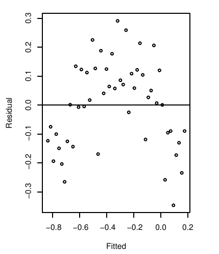

---
title: Example Quiz with Solutions
output:
  html_document:
    css: ../styles/base.css
    highlight: null
    theme: null
    includes:
      in_header: ../styles/notebook.html
--- 

## Instructions

>  Write your name at the top right.  You are to work on this quiz alone without any help 
>  from any other resource <b>except for a single $8.5 \times 11$ inch page of handwritten notes</b>.  
>  This quiz will be ungraded but must be handed in for attendance. 

## Problems:

### Problem 1:
In the figure below is a plot of the residuals versus the fitted values for some linear model.  Which of our usual assumptions may not hold, and what does this
imply for the linear model?  What test can we use to diagnose the issue?

{width=40%}\

### Problem 2:

In the figure below is a plot of the residuals versus the fitted values for some linear model.  Which of our usual assumptions may not hold, and what does this
imply for the linear model?

{width=40%}\

