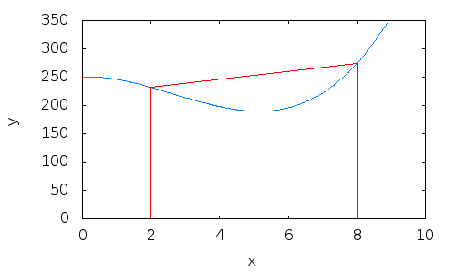

<style>
.section .reveal .state-background {
   background: #ffffff;
}
.section .reveal h1,
.section .reveal h2,
.section .reveal p {
   color: black;
   margin-top: 50px;
   text-align: center;
}
</style>

The title of the presentation and document goes here
========================================================
date: 08/27/2019
autosize: true
incremental: true
width: 1920
height: 1080

<h2 style="text-align:left"> Instructions:</h2>
<p style='text-align:left'>Use the left and right arrow keys to navigate the presentation forward and backward respectively.  You can also use the arrows at the bottom right of the screen to navigate with a mouse.<br></p>

<blockquote>
FAIR USE ACT DISCLAIMER:</br>
This site is for educational purposes only.  This website may contain copyrighted material, the use of which has not been specifically authorized by the copyright holders. The material is made available on this website as a way to advance teaching, and copyright-protected materials are used to the extent necessary to make this class function in a distance learning environment.  The Fair Use Copyright Disclaimer is under section 107 of the Copyright Act of 1976, allowance is made for “fair use” for purposes such as criticism, comment, news reporting, teaching, scholarship, education and research.
</blockquote>


========================================================

## Outline

* We will cover some basic topics in this template:

  * What is the frontmatter at the top of the document
  * What is the frontmatter below the title of the document
  * What is the html below this frontmatter
  * How to write math
  * How to write code
  * Formatting images and text together

========================================================

## Getting started

* You may notice that the formatting takes a particular style.

* Most of this can be found in other documents about Markdown and R Markdown in general.

  * This template will only describe what is unique to the template.
  
* For other resources, it is recommended you see the <a href='https://bookdown.org/yihui/rmarkdown/' target='blank'>The definitive guide on R Markdown</a>.

========================================================

## What is the frontmatter at the top

* I have included an additional style setting for the output HTML at the top of the document.

* Without this, by default the opening slide will not have ADA compliant contrast in the font and background.

* It is recommended that you do not touch the code


```html
<style>
.section .reveal .state-background {
   background: #ffffff;
}
.section .reveal h1,
.section .reveal h2,
.section .reveal p {
   color: black;
   margin-top: 50px;
   text-align: center;
}
</style>
```

unless you feel comfortable editing CSS.

========================================================

## Additional frontmatter

* At the top, you may notice that the title is aligned just above the slide separator.

  * <b>Only use this convention for the opening slide, as otherwise the presentation will skip headings.</b>

* Below the title, there are additional options that I have set to have incremental visualization of  the presentation bullets, as well as typical widescreen ratio.

* This is known as YAML frontmatter, which you can edit but note that there are limited options in the RPres YAML as conpared to regular R Markdown.

* I also include instructions in the opening slide at the suggestion of students who didn't find it immediately obvious how to navigate the presentation.

* Likewise, for sharing my teaching materials I keep a fair use copyright statement in the opening slide.


========================================================

## Math and code

* You can escape into math mode using a ```$``` for inline math and with ```$$``` for line separated math.

  $$e^{i\pi} +1 = 0$$

* Also, three dashes can be used to escape into a code chunk.  You can specify different types of code as is discussed in other documentation.


```r
exp(1i * pi) + 1
```

```
[1] 0+1.224647e-16i
```


========================================================
### Image formatting

<div style="float:left; width:40%">
<ul>
<li> I typically format images in my slides with a mix of divs to place the image, and to place the text in relation to the image.</li>
</ul>
</div>
<div style="float:right; width:50%" class="fragment">

<p style="text-align:center">
<a href="https://commons.wikimedia.org/wiki/File:Trapezium2.gif" title="via Wikimedia Commons">Mkwadee at English Wikipedia</a> / <a href="https://creativecommons.org/licenses/by-sa/3.0">CC BY-SA</a>
</p>
</div>
<div style="float:left; width:40%">
<ul>
  <li>However, when using these divs, you can no longer use plain markdown syntax and you need to utilize full HTML to handle the rich formatting.</li>
  <li>When you become comfortable with div placements, this offers a number of ways to format images and text together for rich slides.</li>
  <li>Remember to include relevant alt text with these images so that the slides still remain accessible.</li>
</ul>
</div>
<div style="float:left; width:100%">
<ul>
  <li>You can use these examples to find different ways to mix images and text together.</li>
</ul>
</div>


